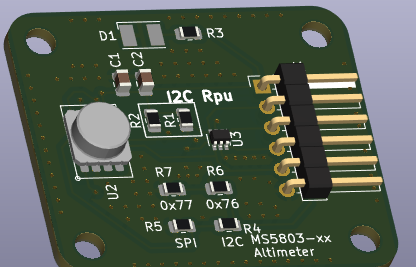
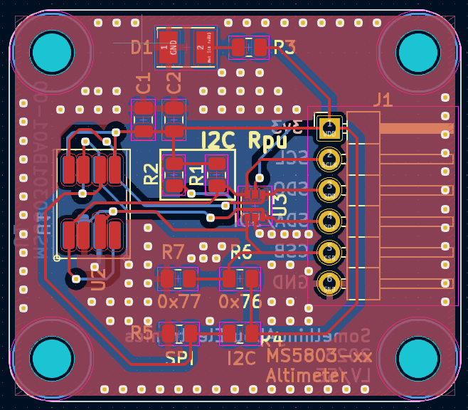
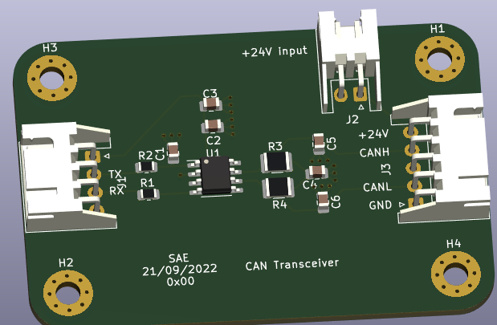
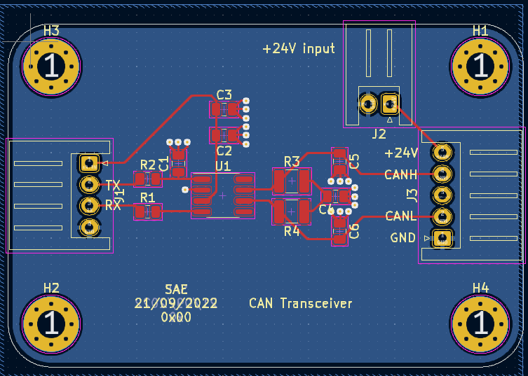

# Sensors
Single repo for all of the sensor and interface breakout pcb's

Altimeter
HW:
Based on the TE MS581 sensor.
FW:
Based on the STM32F411

OPA548_dev  
Programmable CC/CV PSU

CAN Breakout

